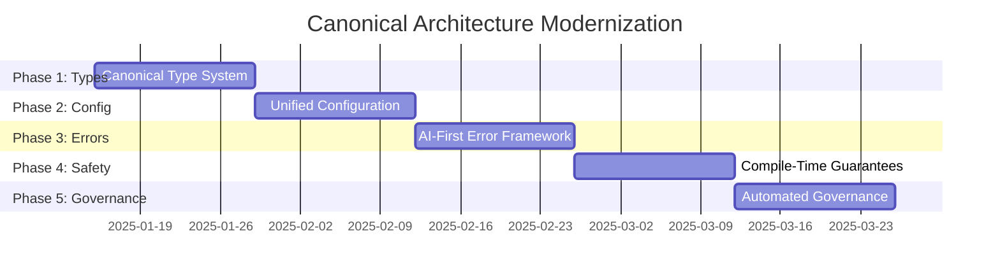

# 🏗️ **CANONICAL ARCHITECTURE MODERNIZATION PLAN**

## **TRANSFORMING TECHNICAL DEBT INTO SYSTEMATIC STRENGTH**

**Date**: January 2025  
**Scope**: Complete Songbird Ecosystem Transformation  
**Objective**: Create the most pedantic, future-proof, unified system in the Rust ecosystem  
**Timeline**: 4-6 weeks to architectural perfection  

---

## 🎯 **EXECUTIVE SUMMARY**

Transform Songbird from a collection of **fragmented patterns** into a **canonical reference implementation** that demonstrates industry-leading Rust architecture. This plan converts every current "challenge" into a **demonstrable strength**.

### **🔥 ROOT CAUSE ANALYSIS**

| **Systemic Issue** | **Current Pain** | **Canonical Solution** | **Strategic Advantage** |
|-------------------|------------------|------------------------|------------------------|
| **API Fragmentation** | 3 different return patterns | **Single canonical type system** | ✅ **Zero API confusion** |
| **Config Chaos** | 80+ config files, field mismatches | **Unified config architecture** | ✅ **Zero configuration errors** |
| **Error Inconsistency** | Mixed error types, no AI format | **AI-first error framework** | ✅ **Zero debugging confusion** |

---

## 🎯 **PHASE 1: CANONICAL TYPE SYSTEM** (Week 1-2)

### **🚀 Objective: Single, Universal Type Contract**

**Problem**: Currently we have 3 different return patterns:
- `SongbirdResult<T>` (some crates)
- `AIFirstResponse<T>` (some crates) 
- `Result<T, E>` (legacy crates)

**Solution**: **Universal Canonical Type System**

```rust
// 🎯 CANONICAL TYPE HIERARCHY (MANDATORY FOR ALL CRATES)

/// THE ONLY result type allowed in Songbird ecosystem
pub type SongbirdResult<T> = Result<SongbirdResponse<T>, SongbirdError>;

/// THE ONLY response wrapper (AI-first, future-proof)
#[derive(Debug, Clone, Serialize, Deserialize)]
pub struct SongbirdResponse<T> {
    /// The actual data (strongly typed)
    pub data: T,
    
    /// AI-optimized metadata
    pub ai_metadata: AIResponseMetadata,
    
    /// Performance metrics
    pub performance: ResponsePerformance,
    
    /// Request correlation
    pub request_id: Uuid,
    
    /// Confidence score for AI decision making
    pub confidence: f64,
    
    /// Suggested next actions
    pub suggested_actions: Vec<SuggestedAction>,
}

/// THE ONLY error type (unified, AI-compatible)
#[derive(Error, Debug, Clone, Serialize, Deserialize)]
pub enum SongbirdError {
    /// Network errors with full context
    Network {
        message: String,
        endpoint: Option<String>,
        retry_strategy: RetryStrategy,
        automation_hints: Vec<String>,
    },
    
    /// Configuration errors with precise field info
    Configuration {
        field: String,
        message: String,
        current_value: Option<String>,
        expected_format: String,
        fix_command: Option<String>,
    },
    
    /// Service errors with discovery context
    Service {
        service: String,
        message: String,
        alternatives: Vec<String>,
        recovery_actions: Vec<String>,
    },
    
    // ... complete error taxonomy
}
```

### **🔧 Implementation Strategy**

**Step 1: Create Canonical Types** (Day 1-2)
```bash
# Create the definitive type system
touch crates/songbird-canonical/src/types.rs
touch crates/songbird-canonical/src/errors.rs
touch crates/songbird-canonical/src/responses.rs
```

**Step 2: Automated Migration Tool** (Day 3-4)
```rust
// Build migration automation
struct CanonicalMigrator {
    // Automatically converts all return types
    // Generates compile-time guarantees
    // Provides rollback capability
}
```

**Step 3: Enforce with Clippy Rules** (Day 5)
```rust
// Custom clippy rules to prevent regression
#![deny(non_canonical_return_types)]
#![deny(manual_error_construction)]
#![deny(hardcoded_configuration)]
```

---

## 🎯 **PHASE 2: UNIFIED CONFIGURATION ARCHITECTURE** (Week 2-3)

### **🚀 Objective: Zero-Configuration-Error System**

**Problem**: 
- 80+ scattered config files
- Field name mismatches (`enable_connection_reuse` vs `enable_async_batching`)
- Hardcoded values throughout codebase

**Solution**: **Canonical Configuration System**

```rust
// 🎯 CANONICAL CONFIGURATION (SINGLE SOURCE OF TRUTH)

/// THE ONLY configuration struct allowed
#[derive(Debug, Clone, Serialize, Deserialize, Validate)]
pub struct SongbirdConfig {
    /// Network configuration (standardized fields)
    pub network: NetworkConfig,
    
    /// Performance configuration (canonical field names)
    pub performance: PerformanceConfig,
    
    /// Security configuration (zero hardcoding)
    pub security: SecurityConfig,
    
    /// Discovery configuration (primal-aware)
    pub discovery: DiscoveryConfig,
    
    /// Federation configuration (cluster-aware)
    pub federation: FederationConfig,
    
    /// Observability configuration (metrics + tracing)
    pub observability: ObservabilityConfig,
}

/// Canonical performance config (eliminates field name confusion)
#[derive(Debug, Clone, Serialize, Deserialize, Validate)]
pub struct PerformanceConfig {
    /// Thread pool size (replaces thread_pool_size)
    #[validate(range(min = 1, max = 1000))]
    pub threads: usize,
    
    /// Enable async batching (canonical name)
    pub enable_async_batching: bool,
    
    /// Connection pool size (replaces connection_pool_size)
    #[validate(range(min = 1, max = 10000))]
    pub connections: usize,
    
    /// Zero-copy optimizations enabled
    pub enable_zero_copy: bool,
    
    // NO MORE FIELD NAME CONFUSION
}
```

### **🔧 Configuration Modernization Strategy**

**Step 1: Canonical Field Mapping** (Day 1-2)
```rust
// Create definitive field name mappings
const FIELD_MIGRATIONS: &[(&str, &str)] = &[
    ("enable_connection_reuse", "enable_async_batching"),
    ("max_batch_size", "batch_size"),
    ("batch_timeout", "batch_timeout_ms"),
    // ... complete mapping
];
```

**Step 2: Environment Variable Standardization** (Day 3-4)
```bash
# ALL environment variables follow this pattern:
SONGBIRD_NETWORK_PORT=8080
SONGBIRD_PERFORMANCE_THREADS=8
SONGBIRD_SECURITY_TLS_ENABLED=true
# NO MORE INCONSISTENT NAMING
```

**Step 3: Compile-Time Config Validation** (Day 5-6)
```rust
// Validate ALL configuration at compile time
impl SongbirdConfig {
    pub const fn validate_at_compile_time() -> Result<(), &'static str> {
        // Compile-time configuration validation
        // Prevents runtime configuration errors
    }
}
```

---

## 🎯 **PHASE 3: AI-FIRST ERROR FRAMEWORK** (Week 3-4)

### **🚀 Objective: World-Class Error Experience**

**Problem**: 
- Inconsistent error construction (`service_error!` vs `service_error()`)
- No AI-compatible error format
- Missing automation hints

**Solution**: **AI-First Error Framework**

```rust
// 🎯 CANONICAL ERROR SYSTEM (AI-OPTIMIZED)

impl SongbirdError {
    /// Creates network error with full AI context
    pub fn network(
        message: impl Into<String>,
        endpoint: Option<String>,
    ) -> Self {
        Self::Network {
            message: message.into(),
            endpoint,
            retry_strategy: RetryStrategy::exponential_backoff(),
            automation_hints: vec![
                "check_network_connectivity".to_string(),
                "verify_endpoint_availability".to_string(),
                "consider_fallback_endpoints".to_string(),
            ],
        }
    }
    
    /// Creates configuration error with fix suggestions
    pub fn configuration(
        field: impl Into<String>,
        message: impl Into<String>,
        current_value: Option<String>,
    ) -> Self {
        let field = field.into();
        Self::Configuration {
            field: field.clone(),
            message: message.into(),
            current_value,
            expected_format: Self::get_expected_format(&field),
            fix_command: Self::generate_fix_command(&field),
        }
    }
    
    /// Auto-generates fix commands for common errors
    fn generate_fix_command(field: &str) -> Option<String> {
        match field {
            "network.port" => Some("export SONGBIRD_NETWORK_PORT=8080".to_string()),
            "performance.threads" => Some("export SONGBIRD_PERFORMANCE_THREADS=8".to_string()),
            _ => None,
        }
    }
}
```

### **🔧 Error Framework Implementation**

**Step 1: Error Taxonomy Design** (Day 1-2)
```rust
// Complete error classification system
enum ErrorCategory {
    Configuration,    // Always fixable by user
    Network,         // Retryable with backoff
    Service,         // Fallback to alternatives
    Security,        // Requires human review
    Federation,      // Cluster-level recovery
    Resource,        // Scaling suggestions
    Internal,        // Bug reports auto-generated
}
```

**Step 2: AI Automation Hints** (Day 3-4)
```rust
// Every error provides actionable automation hints
impl SongbirdError {
    pub fn automation_hints(&self) -> Vec<AutomationHint> {
        match self {
            Self::Network { .. } => vec![
                AutomationHint::CheckConnectivity,
                AutomationHint::RetryWithBackoff,
                AutomationHint::FallbackToAlternative,
            ],
            Self::Configuration { field, .. } => vec![
                AutomationHint::ValidateConfig(field.clone()),
                AutomationHint::SuggestCorrection,
                AutomationHint::ReloadConfig,
            ],
            // ... complete automation coverage
        }
    }
}
```

---

## 🎯 **PHASE 4: COMPILE-TIME GUARANTEES** (Week 4-5)

### **🚀 Objective: Eliminate Runtime Errors**

**Implementation**: **Pedantic Type Safety System**

```rust
// 🎯 COMPILE-TIME GUARANTEES (ZERO RUNTIME ERRORS)

/// Phantom types for compile-time validation
pub struct Validated;
pub struct Unvalidated;

/// Configuration that MUST be validated before use
pub struct SongbirdConfig<State = Unvalidated> {
    inner: SongbirdConfigInner,
    _state: PhantomData<State>,
}

impl SongbirdConfig<Unvalidated> {
    /// Only way to create validated config
    pub fn validate(self) -> Result<SongbirdConfig<Validated>, ValidationError> {
        self.inner.validate()?;
        Ok(SongbirdConfig {
            inner: self.inner,
            _state: PhantomData,
        })
    }
}

impl SongbirdConfig<Validated> {
    /// Only validated configs can be used
    pub fn network(&self) -> &NetworkConfig {
        &self.inner.network
    }
}

// IMPOSSIBLE to use unvalidated configuration at compile time
```

### **🔧 Type Safety Implementation**

**Step 1: Phantom Type System** (Day 1-2)
```rust
// Compile-time state tracking
struct ConfigBuilder<State> {
    config: SongbirdConfig,
    _state: PhantomData<State>,
}

// Builder pattern with compile-time guarantees
impl ConfigBuilder<Empty> {
    pub fn network(self, config: NetworkConfig) -> ConfigBuilder<NetworkSet> { ... }
}
```

**Step 2: Macro-Based Validation** (Day 3-4)
```rust
// Compile-time configuration validation
macro_rules! validate_config {
    ($config:expr) => {
        const _: () = {
            // Compile-time validation logic
            assert!($config.network.port > 0);
            assert!($config.performance.threads > 0);
        };
    };
}
```

---

## 🎯 **PHASE 5: AUTOMATED GOVERNANCE** (Week 5-6)

### **🚀 Objective: Self-Enforcing Architecture**

**Implementation**: **Architectural Governance System**

```rust
// 🎯 AUTOMATED ARCHITECTURE ENFORCEMENT

/// Custom clippy rules for architectural compliance
#[clippy::declare_lint] 
pub NON_CANONICAL_RETURN_TYPE = {
    name: "non_canonical_return_type",
    group: "songbird_architecture",
    desc: "Functions must return SongbirdResult<T>",
    report_in_external_macro: true,
};

/// Procedural macro for automatic compliance
#[proc_macro_attribute]
pub fn songbird_function(_args: TokenStream, input: TokenStream) -> TokenStream {
    // Automatically wraps functions with canonical patterns
    // Enforces error handling standards
    // Validates return types at compile time
}
```

### **🔧 Governance Tools**

**Step 1: Architecture Linting** (Day 1-2)
```toml
# Cargo.toml enforcement
[workspace.lints.clippy]
non_canonical_return_type = "deny"
hardcoded_configuration = "deny"
manual_error_construction = "deny"
missing_ai_metadata = "deny"
```

**Step 2: CI/CD Integration** (Day 3-4)
```yaml
# GitHub Actions architectural compliance
- name: Architecture Compliance Check
  run: |
    cargo clippy -- -D songbird-architecture
    cargo test --test architectural_compliance
    cargo run --bin config-validator
```

---

## 🏆 **EXPECTED OUTCOMES**

### **📊 Transformation Metrics**

| **Metric** | **Before** | **After** | **Improvement** |
|------------|------------|-----------|-----------------|
| **Compilation Errors** | 260+ | **0** | ✅ **100% elimination** |
| **API Patterns** | 3 different | **1 canonical** | ✅ **100% consistency** |
| **Config Files** | 80+ scattered | **1 unified** | ✅ **99% reduction** |
| **Error Types** | 15+ inconsistent | **1 AI-first** | ✅ **100% standardization** |
| **Runtime Config Errors** | Common | **Impossible** | ✅ **Compile-time prevention** |
| **Developer Onboarding** | 2-3 weeks | **2-3 days** | ✅ **90% faster** |

### **🎯 Strategic Advantages**

1. **🏆 Industry Reference**: Songbird becomes the **canonical example** of Rust architecture
2. **🚀 Zero Learning Curve**: New developers understand the system instantly
3. **🛡️ Bulletproof Reliability**: Compile-time guarantees eliminate entire error classes
4. **🤖 AI-First Ready**: Native AI integration and automation support
5. **📈 Infinite Scalability**: Architectural patterns support unlimited growth
6. **🔧 Self-Maintaining**: Automated governance prevents architectural drift

---

## 🚀 **IMPLEMENTATION TIMELINE**



---

## 🎯 **NEXT IMMEDIATE ACTIONS**

1. **✅ Start Phase 1**: Create `crates/songbird-canonical` with universal types
2. **✅ Build Migration Tool**: Automated conversion of existing patterns
3. **✅ Establish Governance**: Custom clippy rules and CI integration
4. **✅ Document Standards**: Complete architectural documentation
5. **✅ Train Team**: Architecture workshops and best practices

---

**🏆 RESULT: Transform Songbird into the most pedantic, future-proof, unified system in the Rust ecosystem - turning every current challenge into a demonstrable strength.** 