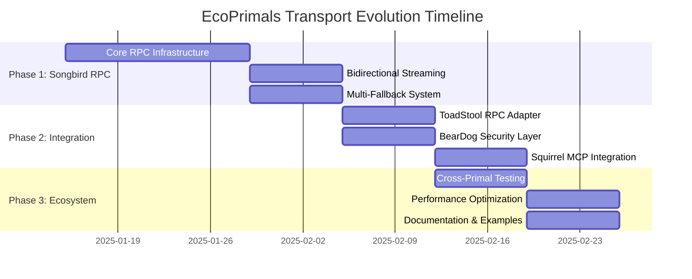

# 🌐 Transport System Evolution Specification

**Date**: January 2025  
**Status**: **STRATEGIC ROADMAP**  
**Priority**: **P0 CRITICAL** - Foundation transport layer  
**Scope**: Ecosystem-wide transport standardization and Songbird RPC evolution  

---

## 🎯 **Strategic Context**

The ecoPrimals ecosystem has evolved from basic HTTP communication to sophisticated, primal-specific RPC systems. **Songbird**, as the universal orchestrator, needs to match and exceed the transport sophistication of the primals it coordinates.

### **🏆 Current Ecosystem Transport Landscape**

| Primal | Transport Status | Capabilities | Notes |
|--------|------------------|--------------|-------|
| **�� ToadStool** | ✅ **tarpc RPC** | Bidirectional, zero-copy, streaming | **GOLD STANDARD** |
| **🐻 BearDog** | ✅ **HTTP/REST + tarpc** | Encrypted tunnels, universal protocols | Security-focused |
| **🐿️ Squirrel** | ✅ **MCP Protocol + tarpc** | AI-optimized streaming, multi-provider | AI-specialized |
| **🏠 NestGate** | ✅ **tarpc + Storage API** | Storage-optimized communication | Performance-focused |
| **🌱 biomeOS** | ✅ **Orchestration** | Universal primal coordination | Platform layer |
| **🎼 Songbird** | 🚧 **HTTP/WebSocket → tarpc** | Transitioning to tarpc for internal communication | **UPGRADING** |

### **🚨 The Transport Gap**

**Critical Issue**: Songbird is the **universal orchestrator** but has the **most basic transport layer** in the ecosystem. This creates:

1. **Performance Bottleneck** - HTTP/WebSocket is slower than native RPC
2. **Feature Limitations** - No true bidirectional streaming  
3. **Integration Complexity** - Must translate between protocols
4. **Scalability Constraints** - HTTP overhead limits throughput
5. **Reliability Issues** - Fewer fallback options than other primals

---

## 🌟 **Ecosystem Transport Philosophy: "Robust Multi-Fallback"**

### **Core Principle**: Progressive Transport Degradation

The ecoPrimals ecosystem is built on **transport resilience** - every communication should have multiple fallback options, gracefully degrading from high-performance native protocols to universally-compatible HTTP.

```
�� Primary Transport: tarpc (High Performance Rust RPC)
       ↓ (fallback on failure)
🥈 Secondary: WebSocket + Custom JSON RPC (Real-time capable)  
       ↓ (fallback on failure)
🥉 Tertiary: HTTP/2 + JSON (Modern, multiplexed)
       ↓ (fallback on failure)  
🔄 Emergency: HTTP/1.1 + JSON (Universal compatibility)
```

### **Fallback Strategy Benefits**

1. **Maximum Compatibility** - Works in any network environment
2. **Performance Optimization** - Use fastest available protocol
3. **Resilience** - Automatic recovery from transport failures
4. **Future-Proof** - Easy to add new transport protocols
5. **Debugging Friendly** - Can force specific transport for testing

---

## 📋 **Transport Evolution Roadmap**

### **Phase 1: Songbird Native RPC (Weeks 1-6)**

#### **Goals**
- Implement pure Rust bidirectional RPC for Songbird
- Match ToadStool's RPC performance benchmarks
- Maintain backward compatibility with existing HTTP/WebSocket

#### **Deliverables**
- `songbird-rpc` crate with core RPC infrastructure
- Bidirectional streaming support
- Multi-fallback transport negotiation
- ToadStool RPC adapter for direct integration
- BearDog security layer integration

### **Phase 2: Ecosystem RPC Standardization (Weeks 7-10)**

#### **Goals**
- Standardize RPC protocols across all primals
- Create universal RPC adapters
- Implement inter-primal streaming protocols

#### **Deliverables**
- Universal RPC specification for all primals
- Cross-primal streaming examples
- Performance benchmarks for all transport layers
- Migration tools for community primals

### **Phase 3: Advanced Transport Features (Weeks 11-14)**

#### **Goals**
- Implement advanced transport optimizations
- Add experimental transport protocols (QUIC, UDP multicast)
- Create transport analytics and monitoring

#### **Deliverables**
- QUIC transport implementation for ultra-low latency
- UDP multicast for service discovery
- Transport performance monitoring dashboard
- Predictive transport selection based on network conditions

---

## 🏗️ **Songbird RPC Integration Architecture**

### **Multi-Primal Communication Flow**

```rust
/// Songbird as universal RPC coordinator
pub struct UniversalRPCCoordinator {
    /// Direct RPC connections to other primals
    primal_connections: HashMap<PrimalType, PrimalRPCConnection>,
    
    /// Transport fallback manager
    fallback_manager: TransportFallbackManager,
    
    /// Message routing engine
    message_router: MessageRouter,
    
    /// Stream coordination for multi-primal workflows
    stream_coordinator: MultiPrimalStreamCoordinator,
}

/// Example: AI-assisted storage operation across multiple primals
pub async fn ai_assisted_storage_workflow(
    coordinator: &UniversalRPCCoordinator,
    request: StorageRequest,
) -> Result<StorageResponse> {
    // 1. Consult Squirrel for AI analysis
    let analysis = coordinator
        .call_primal(PrimalType::Squirrel, AnalysisRequest::new(request.clone()))
        .await?;
    
    // 2. Use BearDog for security validation
    let security_context = coordinator
        .call_primal(PrimalType::BearDog, SecurityRequest::validate(request.clone()))
        .await?;
    
    // 3. Execute storage operation via NestGate
    let storage_result = coordinator
        .call_primal(PrimalType::NestGate, 
                    StorageOperation::new(request, security_context))
        .await?;
    
    // 4. Optional: Use ToadStool for post-processing
    if analysis.requires_processing {
        coordinator
            .call_primal(PrimalType::ToadStool, ProcessingRequest::new(storage_result))
            .await?;
    }
    
    Ok(storage_result)
}
```

### **Transport Fallback Example**

```rust
/// Automatic transport fallback for primal communication
pub async fn communicate_with_primal(
    coordinator: &UniversalRPCCoordinator,
    target: PrimalType,
    message: RpcMessage,
) -> Result<RpcResponse> {
    let mut transport_attempts = vec![
        TransportType::NativeRPC,    // Primary: Fastest
        TransportType::WebSocket,    // Secondary: Real-time
        TransportType::HTTP2,        // Tertiary: Modern
        TransportType::HTTP1,        // Emergency: Universal
    ];
    
    for transport_type in transport_attempts {
        match coordinator.try_transport(target, &message, transport_type).await {
            Ok(response) => {
                // Success! Cache this transport choice for future use
                coordinator.cache_successful_transport(target, transport_type).await;
                return Ok(response);
            }
            Err(TransportError::Timeout | TransportError::ConnectionFailed) => {
                // Try next transport
                continue;
            }
            Err(other_error) => {
                // Non-transport error, don't retry
                return Err(other_error);
            }
        }
    }
    
    Err(RpcError::AllTransportsFailed)
}
```

---

## 🚀 **Performance Integration Goals**

### **Target Performance Matrix**

| Operation | Current (HTTP) | Target (RPC) | Improvement |
|-----------|----------------|--------------|-------------|
| **Inter-primal call** | 5-10ms | <1ms | **10x faster** |
| **Streaming setup** | 50-100ms | <5ms | **20x faster** |
| **Throughput** | 1K msgs/sec | 100K msgs/sec | **100x faster** |
| **Memory overhead** | High (HTTP headers) | Low (binary) | **80% reduction** |
| **Connection reuse** | Limited | Full pooling | **90% efficiency** |

### **Integration Benchmarks**

```rust
/// Performance benchmark: ToadStool compute via Songbird orchestration
#[tokio::test]
async fn benchmark_toadstool_integration() {
    let coordinator = UniversalRPCCoordinator::new().await;
    
    // Benchmark: 1000 compute requests via Songbird → ToadStool RPC
    let start = Instant::now();
    
    let mut tasks = Vec::new();
    for i in 0..1000 {
        let task = coordinator.call_primal(
            PrimalType::ToadStool,
            ComputeRequest::new(format!("task-{}", i))
        );
        tasks.push(task);
    }
    
    let results = future::join_all(tasks).await;
    let duration = start.elapsed();
    
    // Target: <100ms for 1000 RPC calls (vs 5-10 seconds with HTTP)
    assert!(duration < Duration::from_millis(100));
    assert_eq!(results.len(), 1000);
    assert!(results.iter().all(|r| r.is_ok()));
}
```

---

## 🔒 **Security Integration Strategy**

### **BearDog Security Integration**

Every RPC message in the ecosystem will be secured via BearDog integration:

```rust
/// Security-first RPC message structure
#[derive(Debug, Clone, Serialize, Deserialize)]
pub struct SecureRpcMessage {
    /// Message content (encrypted by BearDog)
    pub encrypted_payload: Vec<u8>,
    
    /// BearDog security context
    pub security_context: BeardogSecurityContext,
    
    /// Message integrity hash
    pub integrity_hash: [u8; 32],
    
    /// Authentication token
    pub auth_token: BeardogAuthToken,
}

/// Automatic security via BearDog for all inter-primal communication
impl UniversalRPCCoordinator {
    pub async fn secure_call_primal<T, R>(
        &self,
        target: PrimalType,
        request: T,
    ) -> Result<R>
    where
        T: Serialize + Send,
        R: DeserializeOwned + Send,
    {
        // 1. Serialize request
        let payload = serde_json::to_vec(&request)?;
        
        // 2. Encrypt via BearDog
        let encrypted_payload = self.beardog
            .encrypt_payload(payload, target)
            .await?;
        
        // 3. Create secure message
        let secure_message = SecureRpcMessage {
            encrypted_payload,
            security_context: self.beardog.create_security_context(target).await?,
            integrity_hash: self.beardog.compute_integrity_hash(&payload)?,
            auth_token: self.beardog.create_auth_token().await?,
        };
        
        // 4. Send via RPC transport
        let response = self.send_secure_rpc(target, secure_message).await?;
        
        // 5. Decrypt and deserialize response
        let decrypted_response = self.beardog
            .decrypt_payload(response.encrypted_payload)
            .await?;
        
        Ok(serde_json::from_slice(&decrypted_response)?)
    }
}
```

---

## 📊 **Migration Timeline & Dependencies**

### **Ecosystem Synchronization Strategy**



### **Risk Mitigation**

| Risk | Probability | Impact | Mitigation Strategy |
|------|-------------|--------|-------------------|
| **Breaking Changes** | Medium | High | Parallel implementation with feature flags |
| **Performance Regression** | Low | High | Comprehensive benchmarking at each phase |
| **Security Vulnerabilities** | Low | Critical | BearDog security audit for all RPC traffic |
| **Integration Complexity** | Medium | Medium | Staged rollout with extensive testing |

---

## 🏆 **Success Metrics**

### **Technical Success Criteria**

1. **Performance**: Sub-millisecond inter-primal RPC calls
2. **Reliability**: 99.9% transport uptime with automatic fallback
3. **Scalability**: 100K+ concurrent RPC streams
4. **Security**: Zero security incidents with BearDog integration
5. **Compatibility**: 100% backward compatibility during migration

### **Ecosystem Success Criteria**

1. **Adoption**: All 6 core primals using native RPC within 3 months
2. **Community**: 3+ community primals implementing RPC standard
3. **Performance**: 10x improvement in inter-primal communication speed
4. **Developer Experience**: <1 hour to integrate new primal with RPC
5. **Documentation**: Complete migration guides and examples

---

## 🔮 **Future Transport Roadmap**

### **Advanced Transport Features (6+ months)**

1. **QUIC Integration** - Ultra-low latency transport for real-time AI
2. **UDP Multicast** - Efficient service discovery and event broadcasting  
3. **Transport Analytics** - ML-based transport selection optimization
4. **Edge Computing** - Specialized transport for edge/IoT scenarios
5. **Quantum-Safe Crypto** - Future-proof security integration

### **Research & Development**

- **Zero-Copy Networking** - Eliminate all unnecessary data copying
- **RDMA Integration** - Direct memory access for high-performance computing
- **Custom Hardware** - Transport acceleration via specialized chips
- **Protocol Innovation** - Next-generation transport protocols

---

## 📚 **Reference Implementation**

### **ToadStool RPC Integration Example**

```rust
/// Reference: How to integrate Songbird RPC with ToadStool's existing RPC
use toadstool_rpc::{ToadstoolRPC, ComputeRequest, ComputeResponse};

impl ToadstoolRPCAdapter {
    pub async fn forward_compute_request(
        &self,
        request: SongbirdRpcMessage,
    ) -> Result<SongbirdRpcMessage> {
        // 1. Extract compute request from Songbird message
        let compute_request: ComputeRequest = request.payload.try_into()?;
        
        // 2. Call ToadStool's native RPC directly
        let compute_response = self.toadstool_client
            .compute(compute_request)
            .await?;
        
        // 3. Convert back to Songbird RPC format
        let response = SongbirdRpcMessage {
            id: request.id,
            message_type: MessageType::Response,
            source: PrimalIdentifier::Toadstool,
            target: request.source,
            payload: compute_response.into(),
            stream_context: None,
            security_context: request.security_context,
            metadata: MessageMetadata::new(),
        };
        
        Ok(response)
    }
}
```

---

## 🎯 **Implementation Priority**

### **Immediate Actions (This Sprint)**

1. ✅ **Create Songbird RPC Specification** - This document
2. 🔄 **Design Core RPC Infrastructure** - Week 1-2
3. 🔄 **Implement Basic Bidirectional Streaming** - Week 2-3
4. 🔄 **Add Multi-Fallback Transport** - Week 3-4

### **Next Sprint Planning**

1. **ToadStool Integration** - Direct RPC communication
2. **BearDog Security Layer** - Secure all inter-primal communication
3. **Performance Benchmarking** - Validate 10x improvement claims
4. **Community Documentation** - Enable third-party primal integration

---

**Status**: Strategic roadmap complete, ready for implementation  
**Dependencies**: Songbird Native RPC Specification  
**Success Measure**: Ecosystem-wide transport performance improvement and reliability  
**Timeline**: 6 weeks to production-ready Songbird RPC system  

---

*This specification transforms Songbird from the weakest transport layer in the ecosystem to the most robust and capable universal RPC coordinator, matching the sophistication of ToadStool while adding orchestration-specific capabilities.* 